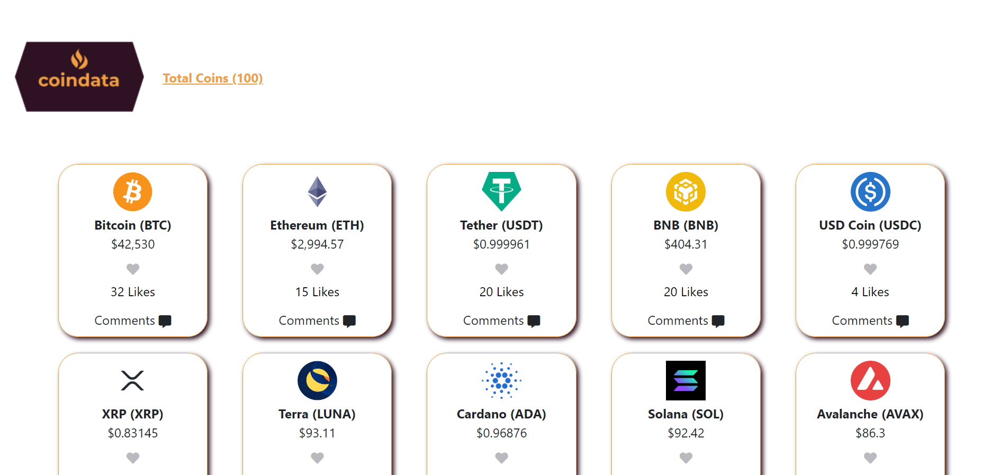
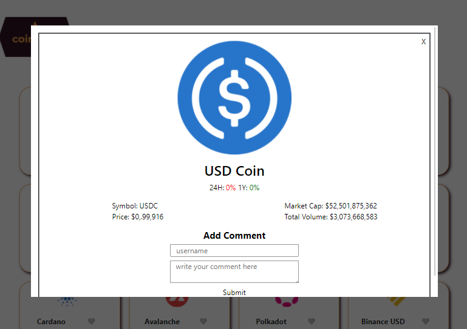

# Javascript Capstone Project

> This project is a web application that fetchs cryptocurrency data from a distant API and display it so users can check all info details of a currency like add comment and see other users comments and likes. 

## Video Demo
https://drive.google.com/file/d/1-xuiTCdHtBemcroUUKqWTBp7AIWeNW0O/view?usp=sharing

## Built With

- HTML, CSS, JavaScript

## Live Demo

[Live Demo Link](https://damdafayton.github.io/capstone-javascript/dist/)

## Getting Started

> To run production
- $ `./dist/index.html`

> To run development
- $ `npm install`
- $ `npm start`

> To test
- $ `npm install -g jest`
- $ `jest`

## Authors

👤 **damdafayton**

- [Github](https://github.com/damdafayton)
- [LinkedIn](https://linkedin.com/in/damdafayton)

👤 **Souad988**

- GitHub: [@githubhandle](https://github.com/souad988)
- LinkedIn: [LinkedIn](www.linkedin.com/in/souad-el-mansouri-4725491a0)

## 🤝 Contributing

Contributions, issues, and feature requests are welcome!

Feel free to check the [issues page](../../issues/).

## Show your support

Give a ⭐️ if you like this project!

## 📝 License

This project is [MIT](./MIT.md) licensed.
